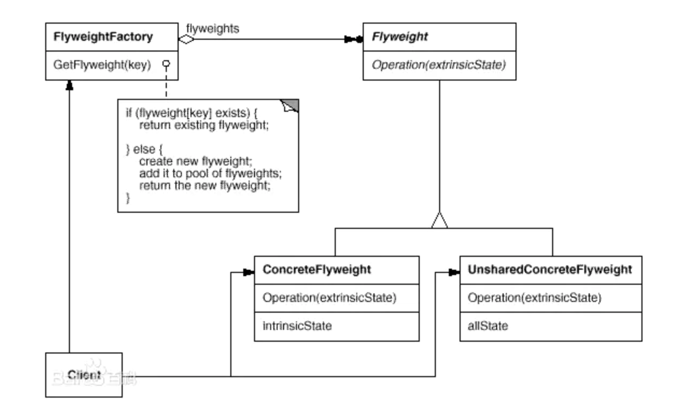
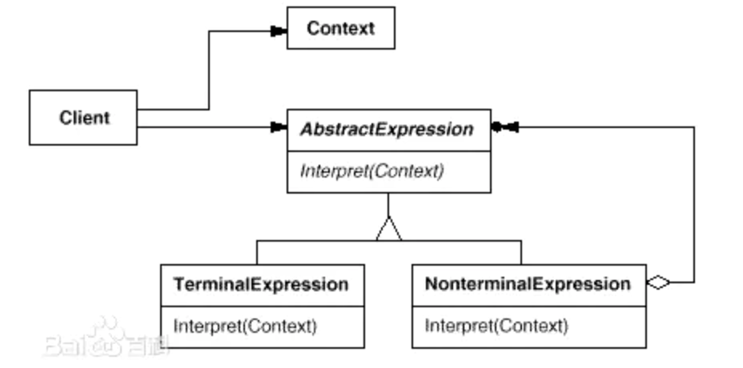
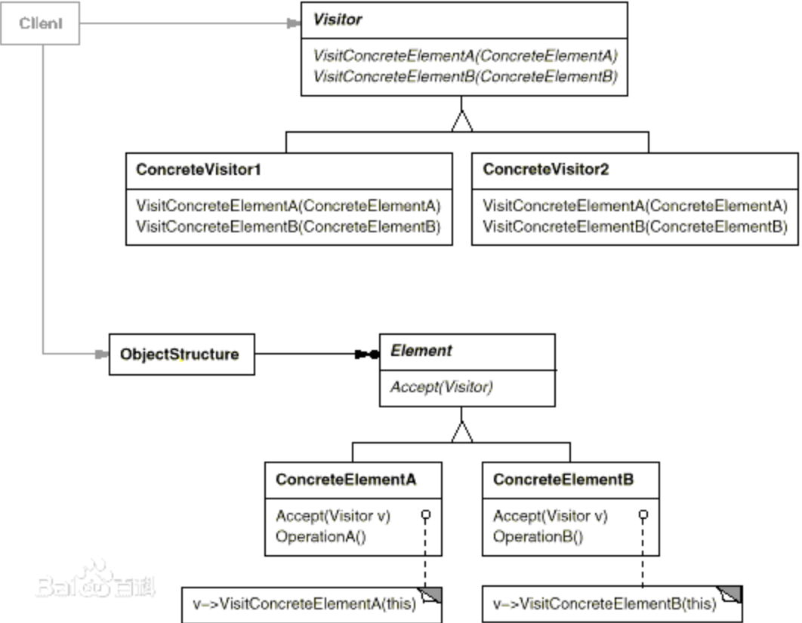

# iOS设计模式详解


> 在软件工程中，(引自维基百科)[设计模式](https://zh.wikipedia.org/wiki/设计模式_(计算机))（design pattern）是对软件设计中普遍存在（反复出现）的各种问题，所提出的解决方案。这个术语是由埃里希·伽玛（Erich Gamma）等人在1990年代从建筑设计领域引入到计算机科学的。 设计模式并不直接用来完成代码的编写，而是描述在各种不同情况下，要怎么解决问题的一种方案。面向对象设计模式通常以类别或对象来描述其中的关系和相互作用，但不涉及用来完成应用程序的特定类别或对象。设计模式能使不稳定依赖于相对稳定、具体依赖于相对抽象，避免会引起麻烦的紧耦合，以增强软件设计面对并适应变化的能力。

使用设计模式的目的：为了代码可重用性、让代码更容易被他人理解、保证代码可靠性。 设计模式使代码编写真正工程化；设计模式是[软件工程](https://baike.baidu.com/item/软件工程/25279)的基石脉络，如同大厦的结构一样。

讲到设计模式，必然要提设计原则，同样为了实现代码复用，要遵循软件设计原则。设计模式就是实现了这些原则，达到了代码的复用、可维护的目的。**下面从7种设计原则，23种设计模式，来讲解软件编写过程中用到的这些知识点**。

### 设计原则

| 编写 |                   全称                   |       中文        |
| :--: | :--------------------------------------: | :---------------: |
|  S   |     Single Responsibility Principle      |   单一职责原则    |
|  O   |           Open Close Principle           |     开闭原则      |
|  L   |      Liskov Substitution Principle       |   里氏替换原则    |
|  I   |     Interface Segregation Principle      |   接口隔离原则    |
|  D   |      Dependence Inversion Principle      |   依赖倒置原则    |
|  L   |              Law Of Demeter              |    迪米特法则     |
|  C   | Composite/Aggregate Reuse Principle CARP | 组合/聚合复用原则 |

前面五种被称为面向对象设计中常用的SOLID原则。

#### 单一职责原则

理解：不同的类具备不同的职责，各司其职。做系统设计是，如果发现有一个类拥有了两种职责，那么就要问一个问题：可以将这个类分成两个类吗？如果真的有必要，那就分开，千万不要让一个类干的事情太多。

总结：一个类只承担一个职责

例子：我们设计一个订单列表，列表分为待支付、待收货、已收货等列表，那我们是写一个类，使用if判断是哪个类型，然后请求相应的数据，还是写多个类，分别执行各自的功能呢。很多人会觉的写一个类比较省事，但是过多的判断条件，各种职责冗余到一个类中真的好吗，如果待支付列表需要加一些特殊的功能呢，待收货也需要加一些功能呢，那这个类是不是变得条件判断异常的多。所以还是写成多个类，实现各自的逻辑比较好。其实另外我们写列表的Cell，也是一个道理，分成几种类型的Cell去写，而不是一个Cell实现几种类型。

```swift
import Foundation

class OrderList: NSObject {//订单列表
    var waitPayList: WaitPayList?//待支付
    var waitGoodsList: WaitGoodsList?//待收货
    var receivedGoodsList: ReceivedGoodsList?//已收货
}

class WaitPayList: NSObject {
    
}

class WaitGoodsList: NSObject {
    
}

class ReceivedGoodsList: NSObject {
    
}
```

#### 开闭原则

理解：类、模块、函数，可以去扩展，但不要去修改。如果要修改代码，尽量用继承或组合的方式来扩展类的功能，而不是直接修改类的代码。当然，如果能保证对整个架构不会产生任何影响，那就没必要搞的那么复杂，直接改这个类吧。

总结：对软件实体的改动，最好用扩展而非修改的方式。

例子：我们设计支付功能的时候，会用到不同的支付方式，我们可以选择在支付的时候使用判断支付条件然后使用不同的支付方式，然而这种设计真的好吗。如果我们添加了一个支付方法或者删除了一个支付方法是不是要改动pay方法的逻辑，那每一次的调整都要改动pay方法的逻辑是不是不合理了，依据开闭原则具体做法应该是设计扩展支付方式来实现不同的支付。

修改之前代码

```swift
import Foundation

class PayHelper {
    func pay(send: PaySendModel) -> Void {
        if send.type == 0 {
            //支付宝支付
        }
        else if send.type == 1 {
            //微信支付
        }
    }
}

class PaySendModel {
    var type: Int = 0
    var info: [String: AnyHashable]?
}

```

修改之后

```swift
import Foundation

class PayHelper {
    var processors: [Int: PayProcessor]?
    
    func pay(send: PaySendModel) -> Void {
        guard let processors = processors else {return}
        guard let payProcessor: PayProcessor = processors[send.type] else {return}
        
        payProcessor.handle(send: send)//支付
    }
}

class PaySendModel {
    var type: Int = 0
    var info: [String: AnyHashable]?
}

protocol PayProcessor {
    func handle(send: PaySendModel)
}

class AliPayProcessor: PayProcessor {
    func handle(send: PaySendModel) {
        
    }
}

class WeChatPayProcessor: PayProcessor {
    func handle(send: PaySendModel) {
        
    }
}
```

可以看到修改之后的支付，扩展起来是不是很方便，增加支付方式只需要继承PayProcessor就行了，不需要更改pay方法了。

#### 里氏替换原则

理解：一个对象在其出现的任何地方，都可以用子类实例做替换，并且不会导致程序的错误。换句话说，当子类可以在任意地方替换基类且软件功能不受影响时，这种继承关系的建模才是合理的。

总结：子类可以扩展父类的方法，但不应该复写父类的方法。

例子：我们定义汽车的基类，基类里面有行驶的方法，现在我们有个宝马车，宝马车继承汽车基类，也有行驶方法。现在我们想知道宝马车的行驶速度是多少，该怎么设计呢。

修改之前

```swift
import Foundation

class Car {
    func run() {
        print("汽车跑起来了")
    }
}

class BaoMaCar: Car {
    override func run() {
        super.run()
        
        print("当前行驶速度是80Km/h")
    }
}
```

可以看到我们重写了run方法，增加了汽车行驶速度的逻辑，这样是不满足的里氏替换原则的。因为所有基类Car替换成子类BaoMaCar，run方法的行为跟以前不是一模一样了。

修改之后

```swift
import Foundation

class Car {
    func run() {
        print("汽车跑起来了")
    }
}

class BaoMaCar: Car {
    func showSpeed() {
        print("当前行驶速度是80Km/h")
    }
}
```

#### 接口隔离原则

理解：一个类实现的接口中，包含了它不需要的方法。将接口拆分成更小和更具体的接口，有助于解耦，从而更容易重构、更改。

总结：对象不应被强迫依赖它不使用的方法。

例子：我们定义一个汽车接口，要求实现run等方法。

修改之前

```swift
import Foundation

protocol ICar {
    func run()
    func showSpeed()
    func playMusic()
}

class Car: ICar {
    func run() {
        print("汽车跑起来了")
    }
    
    func showSpeed() {
        print("当前行驶速度是80Km/h")
    }
    
    func playMusic() {
        print("播放音乐")
    }
}
```

可以看到我们定义Car实现了ICar的接口，但是并不是每个车都有播放音乐的功能的，这样对于一般的低端车没有这个功能，对于他们来说，这个接口的设计就是冗余的。

修改之后

```swift
import Foundation

protocol IProfessionalCar {//具备一般功能的车
    func run()
    func showSpeed()
}

protocol IEntertainingCar {//具备娱乐功能的车
    func run()
    func showSpeed()
    func playMusic()
}

class SangTaNaCar: IProfessionalCar {//桑塔纳轿车
    func run() {
        print("汽车跑起来了")
    }
    
    func showSpeed() {
        print("当前行驶速度是80Km/h")
    }
}

class BaoMaCar: IEntertainingCar {//宝马轿车
    func run() {
        print("汽车跑起来了")
    }
    
    func showSpeed() {
        print("当前行驶速度是80Km/h")
    }
    
    func playMusic() {
        print("播放音乐")
    }
}
```

接口隔离原则的要求我们，建立单一接口，不要建立庞大臃肿的接口，尽量细化接口，接口中的方法尽量少。这通过分散定义多个接口，可以预防外来变更的扩散，提高系统的灵活性和可维护性。

#### 依赖倒置原则

理解：高层模块不应该依赖低层模块，二者都应该依赖其抽象；抽象不应该依赖细节；细节应该依赖抽象。

总结：面向接口编程，提取出事务的本质和共性。

例子：我们给汽车加油，实现能够加90号的汽油，如果没有，就加93号的汽油。

修改之前

```swift
import Foundation

class Car {
    func refuel(_ gaso: Gasoline90) {
        print("加90号汽油")
    }
    
    func refuel(_ gaso: Gasoline93) {
        print("加93号汽油")
    }
}

class Gasoline90 {
    
}

class Gasoline93 {
    
}
```

上面这段代码有什么问题，可以看到Car高层模块依赖了底层模块Gasoline90和Gasoline93，这样写是不符合依赖倒置原则的。

修改之后

```swift
import Foundation

class Car {
    func refuel(_ gaso: IGasoline) {
        print("加\(gaso.name)汽油")
    }
}

protocol IGasoline {
    var name: String { get }
}

class Gasoline90: IGasoline {
    var name: String = "90号"
}

class Gasoline93: IGasoline {
    var name: String = "93号"
}
```

修改之后我们高层模块Car依赖了抽象IGasoline，底层模块Gasoline90和Gasoline93也依赖了抽象IGasoline，这种设计是符合依赖倒置原则的。

#### 迪米特法则

理解：一个对象对另一个对象了解得越多，那么，它们之间的耦合性也就越强，当修改其中一个对象时，对另一个对象造成的影响也就越大。

总结：一个对象应该对其他对象保持最少的了解，实现低耦合、高内聚。

例子：实现一个给汽车加油的设计，使的我们可以随时保证加油的质量过关。

修改之前

```swift
import Foundation

class Person {
    var car: Car?
    
    func refuel(_ gaso: IGasoline) {
        if gaso.isQuality == true {//如果汽油质量过关，我们就给汽车加油
            car?.refuel(gaso)
        }
    }
}

class Car {
    func refuel(_ gaso: IGasoline) {
        print("加\(gaso.name)汽油")
    }
}

protocol IGasoline {
    var name: String { get }
    var isQuality: Bool { get }
}

class Gasoline90: IGasoline {
    var name: String = "90号"
    var isQuality: Bool = false
}

class Gasoline93: IGasoline {
    var name: String = "93号"
    var isQuality: Bool = true
}
```

可以看到上面有个问题，我们怎么知道汽油的质量是否过关呢，即时我们知道，加油判断油的质量这个事情也不应该由我们来做。

修改之后

```swift
import Foundation

class Person {//给车加油的人
    var car: Car?
    
    func refuel(_ worker: WorkerInPetrolStation, _ gaso: IGasoline) {
        guard let car = car else {return}
        
        worker.refuel(car, gaso)
    }
}

class WorkerInPetrolStation {//加油站工作人员
    func refuel(_ car: Car, _ gaso: IGasoline) {
        if gaso.isQuality == true {//如果汽油质量过关，我们就给汽车加油
            car.refuel(gaso)
        }
    }
}

class Car {
    func refuel(_ gaso: IGasoline) {
        print("加\(gaso.name)汽油")
    }
}

protocol IGasoline {
    var name: String { get }
    var isQuality: Bool { get }
}

class Gasoline90: IGasoline {
    var name: String = "90号"
    var isQuality: Bool = false
}

class Gasoline93: IGasoline {
    var name: String = "93号"
    var isQuality: Bool = true
}
```

可以看到这样我们就实现了低耦合，我们只需要知道有加油站工作人员和要加的汽油就行了，不需要知道太多汽油相关的知识，以及加油相关的操作流程，这些都交给了工作人员，这样是符合我们的迪米特原则的。

#### 组合/聚合复用原则

理解：合成/聚合复用原则就是在一个新的对象里面使用一些已有的对象，使之成为新对象的一部分；新的对象通过向这些对象的委派达到复用已有功能的目的。它的设计原则是：要尽量使用合成/聚合，尽量不要使用继承。

总结：就是说要少用继承，多用合成关系来实现。

继承复用有一定的缺点：比如如果基类发生了改变，那么派生类的的实现就不得不发生改变；而且从超类继承而来的实现是静态的，不可能在运行时发生改变，因此它的灵活性差并最终会限制复用性。

使用组合/聚合复用原则就解决了继承复用的缺点。

例子：我们实现一个角色，可以是雇员、经理等。


人被继承到雇员，学生，经理子类。而实际上，雇员、学生和经理分别描述一种角色，而人可以同时有几种不同的角色。比如，一个人既然是经理了就一定是雇员，使用继承来实现角色，则只能使用每一个人具有一种角色，这显然是不合理的。错误的原因就是把角色的等级结构和人的等级结构混淆起来，把Has-A的关系误认为是Is-A的关系，通过下面的改正就可以正确的做到这一点。


从上图可以看出，每一个人都可以有一个以上的角色，所以一个人可以同时是雇员又是经理。从这个例子可以看出，当一个类是另一个类的角色时，不应该使用继承描述这种关系。

有了以上设计原则，我们可以遵循设计原则实现很多好的设计模式，下面讲讲设计模式。

### 创建型模式

> 在软件工程中，引自维基百科[创建型模式](https://zh.wikipedia.org/wiki/創建型模式)是处理对象创建的设计模式，视图根据实际情况使用合适的方式创建对象。基本的对象创建方式可能会导致设计上的问题，或增加设计的复杂度。创建型模式通过以某种方式控制对象的创建来解决问题。创建型模式由两个主导思想构成。一是将系统使用的具体类封装起来，二是隐藏这些具体类的实例创建和结合的方式。

***主要用于创建对象。***

#### 抽象工厂模式

提供一个接口，用于创建与某些对象相关或依赖于某些对象的类家族，而又不需要指定它们的具体类。通过这种模式可以去除客户代码和来自工厂的具体对象细节之间的耦合关系。

类簇是一种把一个公共的抽象超类下的一些私有的具体子类组合在一起的架构。抽象超类负责声明创建私有子类实例的方法，会根据被调用方法的不同分配恰当的具体子类，每个返回的对象都可能属于不同的私有子类。

Cocoa将类簇限制在数据存储可能因环境而变的对象生成上。Foundation框架为`NSString`、`NSData`、`NSDictionary`、`NSSet`、和`NSArray`对象定义了类簇。公共超类包括上述的不可变类和与其相互补充的可变类`NSMutableString`、`NSMutableData`、`NSMutableDictionary`、`NSMutableSet`、和`NSMutableArray`。


```swift
import Foundation

class GzCity {//广州市有两个啤酒厂
    var abstractFactory1: IAbstractFactory?
    var abstractFactory2: IAbstractFactory?
}

protocol IAbstractFactory {//抽象工厂
    func createProductA() -> IProduct
    func createProductB() -> IProduct
}

protocol IProduct {
    var name: String { get }
}

class BearProduct: IProduct {//啤酒产品
    var name: String = "啤酒"
}

class ConcreteFactory1: IAbstractFactory {//啤酒工厂1
    func createProductA() -> IProduct {
        return BearProduct()
    }
    
    func createProductB() -> IProduct {
        return BearProduct()
    }
}

class ConcreteFactory2: IAbstractFactory {//啤酒工厂2
    func createProductA() -> IProduct {
        return BearProduct()
    }
    
    func createProductB() -> IProduct {
        return BearProduct()
    }
}
```

#### 建造者模式

将一个复杂对象的构建与它的表示分离，使得同样的构建过程可以创建不同的表示。

- 当创建复杂对象的算法应该独立于该对象的组成部分以及它们的装配方式时。
- 当构造过程必须允许被构造的对象有不同的表示时。


```swift
import Foundation

protocol IBuilder {
    func createProduct() -> IProduct
}

protocol IProduct {
    var name: String { get }
}

class BeerProduct: IProduct {
    var name: String = "啤酒"
}

class Director {//领导
    var builder: ConcreteBuilder?
    
    func construct() {//指导生产
        guard let product = builder?.createProduct() else {return}
        print("生产产品" + product.name)
    }
}

class ConcreteBuilder: IBuilder {//生产者
    func createProduct() -> IProduct {
        return BeerProduct()
    }
}
```

#### 工厂方法模式

定义一个用于创建对象的接口，让子类决定实例化哪一个类。Factory Method 使一个类的实例化延迟到其子类。

- 当一个类不知道它所必须创建的对象的类的时候。
- 当一个类希望由它的子类来指定它所创建的对象的时候。
- 当类将创建对象的职责委托给多个帮助子类中的某一个，并且你希望将哪一个帮助子类是代理者这一信息局部化的时候。


```swift
import Foundation

class ConcreteCreator: ICreator {//生产者
    func factoryMethod() -> IProduct {
        return ConcreteProduct()
    }
}

protocol ICreator {
    func factoryMethod() -> IProduct
}

protocol IProduct {
    var name: String { get }
}

class ConcreteProduct: IProduct {
    var name: String = "啤酒"
}
```

#### 原型模式

用原型实例指定创建对象的种类，并且通过拷贝这些原型创建新的对象。

原型模式是非常简单的一种设计模式, 在多数情况下可被理解为一种深复制的行为。在Objective-C中使用原型模式, 首先要遵循NSCoping协议(OC中一些内置类遵循该协议, 例如NSArray, NSMutableArray等)。刚才我们提到了深复制, 一图以述之:


下面为UML图


```swift
import Foundation

class Client {
    var prototype: IPrototype!
    
    func operation() -> IProduct {
        return prototype.clone()
    }
}

protocol IPrototype {
    func clone() -> IProduct
}

protocol IProduct {
    var name: String { get }
}

class ConcreteProduct: IProduct, IPrototype {
    var name: String = "啤酒"
    
    func clone() -> IProduct {
        let p = ConcreteProduct()
        p.name = name
        return p
    }
}
```

#### 单例模式

保证一个类仅有一个实例，并提供一个访问它的全局访问点。该类需要跟踪单一的实例，并确保没有其它实例被创建。单例类适合于需要通过单个对象访问全局资源的场合。

有几个Cocoa框架类采用单例模式，包括`NSFileManager`、`NSWorkspace`、和`NSApplication`类。这些类在一个进程中只能有一个实例。当客户代码向该类请求一个实例时，得到的是一个共享的实例，该实例在首次请求的时候被创建。


```swift
import Foundation

class Singleton {
    static let instance: Singleton = Singleton()
    
    init() {
        
    }
}
```

### 结构型模式

> 在软件工程中[结构型模式](https://zh.wikipedia.org/wiki/結構型模式)是设计模式，借由一以贯之的方式来了解元件间的关系，以简化设计。

主要用于处理类或对象的组合。

#### 适配器模式

将一个类的接口转换成另外一个客户希望的接口。Adapter 模式使得原本由于接口不兼容而不能一起工作的那些类可以一起工作。


我们可以使用适配器模式，把UITableView的接口进行二次封装，统一对外回调我们关心的接口。比如点击cell的事件回调等。

```swift
import Foundation

class ListAdaper<T>: UITableViewDelegate, UITableViewDataSource {
    
    var cellClick: ((_ obj: T) -> Void)?
    
    init(_ tableView: UITableView) {
        tableView.delegate = self
    }
    
    ...
    
    func tableView(_ tableView: UITableView, didSelectRowAt indexPath: IndexPath) {
        cellClick?(datas[indexPath.row])
    }
    
}
```

可以看到以上代码，大大简化了接口的复杂度，适配回调给我们的接口是我们关心和使用的到的就行了。节约了很多的代码成本，增加了维护性。

#### 桥接模式

将抽象部分与它的实现部分分离，使它们都可以独立地变化。


- Abstraction是一个虚基类，Operation()调用Implemetor的OperationImp()方法
- Implemetor父类有两个子类A和B。
- 两个基类间的关系是聚合关系，Abstrction是整体，Implementor是部分，说白了就是Implementor是Abstraction的成员变量。

好了，下面用桥接模式来实现下面这个比较简单的场景： 花园里有一朵牵牛花和一朵牡丹花，牵牛花开会吸引蜜蜂来采蜜，牡丹花开会吸引蝴蝶来采蜜。

```swift
import Foundation

protocol IAbstractInsect {
    func bloomImp()
}

protocol IAbstractFlower {
    var insect: IAbstractInsect? { get }
    
    func bloom()
}

class QianniuHua: IAbstractFlower {
    var insect: IAbstractInsect?
    
    func bloom() {
        print("牵牛花开了")
        insect?.bloomImp()
    }
}

class MudanHua: IAbstractFlower {
    var insect: IAbstractInsect?
    
    func bloom() {
        print("牡丹花开了")
        insect?.bloomImp()
    }
}

class Butterfly: IAbstractInsect {
    func bloomImp() {
        print("蝴蝶来了")
    }
}

class Bee: IAbstractInsect {
    func bloomImp() {
        print("蜜蜂来了")
    }
}

let qianniu = QianniuHua.init()
qianniu.insect = Bee.init()
qianniu.bloom()

let mudan = MudanHua.init()
mudan.insect = Butterfly.init()
mudan.bloom()
```

> 打印如下： 牵牛花开了 蜜蜂来了 牡丹花开了 蝴蝶来了

#### 组合模式

这种模式将互相关联的对象合成为树结构，以表现部分-全部的层次结构。它使客户代码可以统一地处理单独的对象和多个对象的合成结果。

合成对象是模型-视图-控制器聚集模式的一部分。


组合模式最大的优点是他的节点可以自由增加，且调用节点方便。

```swift
import UIKit

class Composite: NSObject {
    var subComposites: NSMutableArray = {NSMutableArray()}()
    var parentComposite: Composite?
    
    func addComposite(comp: Composite) {
        subComposites.add(comp)
        comp.parentComposite = self
    }

    func removeCompositeAtIndex(index:Int)  {
        subComposites.remove(at: index)
    }

    func removeComposite(comp: Composite)  {
        subComposites.remove(comp)
    }

    func removeFromParent()  {
        if (self.parentComposite != nil) {
            self.parentComposite?.removeComposite(comp: self)
        }
    }
}
```

#### 装饰模式

这种模式动态地将额外的责任附加到一个对象上。在进行功能扩展时，装饰是子类化之外的一种灵活的备选方法。和子类化一样，采纳装饰模式可以加入新的行为，而又不必修改已有的代码。装饰将需要扩展的类的对象进行包装，实现与该对象相同的接口，并在将任务传递给被包装对象之前或之后加入自己的行为。装饰模式表达了这样的设计原则：类应该接纳扩展，但避免修改。

装饰是用于对象合成的模式，在您自己的代码中应该鼓励使用对象的合成。然而，Cocoa自己提供了一些基于这种模式的类和机制。在这些实现中，扩展对象并不完全复制它所包装的对象的接口，虽然具体实现中可以使用不同的技术来进行接口共享。

Cocoa在实现某些类时用到了装饰模式，包括`NSAttributedString`、`NSScrollView`、和`NSTableView`。后面两个类是复合视图的例子，它们将其它一些视图类的对象组合在一起，然后协调它们之间的交互。

动态地给一个对象添加一些额外的职责。就增加功能来说，Decorator模式相比生成子类更为灵活。


通过类别实现装饰模式，如果你是一名iOS开发者，你可能立即会想到用类别来实现。没错，用类别实现可以达到同样的效果，而且会更简单。类别是Objective-C的特性，它可以添加类的行为，而不用进行子类化，通过类别添加的方法不会影响类原来的方法，类别也成为类的一部分，并可由其子类继承。

  虽然通过类别可以实现装饰模式，但是这并不是一种严格的实现，由类别添加的方法是编译时绑定的，而装饰模式是动态绑定的，另外类别也没有封装被扩展类的实例。类别适合装饰器不多的时候，上面的例子只有一个NetData装饰器，用类别实现会更轻量，更容易。

#### 外观模式

这种模式为子系统中的一组接口提供统一的接口。表观模式定义一个更高级别的接口，通过减少复杂度和隐藏子系统之间的通讯和依赖性，使子系统更加易于使用。


`NSImage`类为装载和使用基于位图（比如JPEG、PNG、或者TIFF格式）或向量（EPS或PDF格式）的图像提供统一的接口。`NSImage`可以为同一个图像保持多个表示，不同的表示对应于不同类型的`NSImageRep`对象。`NSImage`可以自动选择适合于特定数据类型和显示设备的表示。同时，它隐藏了图像操作和选择的细节，使客户代码可以交替使用很多不同的表示。

- 实现了子系统与客户端之间的松耦合关系。
- 客户端屏蔽了子系统组件，减少了客户端所需处理的对象数目，并使得子系统使用起来更加容易。

在生活中很多地方也用到外观模式，比如购买基金，我们从基金机构那里购买基金，然后他们帮我们管理我们的基金，去操作和运行，我们只管购买和卖出就行了，而不用去管他们内部的操作，下面是UML图和具体实现：


```swift
/// 基金类
class Fund {
    var gu1 = Stock1()
    var gu2 = Stock2()
    var gu3 = Stock3()
    var nd  = NationalDebt()
    var rt  = Realty()

    public func buyFund() {
        print("买入基金")
        gu1.buy()
        gu2.buy()
        gu3.buy()
        nd.buy()
        rt.buy()
    }

    public func shellFund() {
        print("\n卖出基金")
        gu1.shell()
        gu2.shell()
        gu3.shell()
        nd.shell()
        rt.shell()
    }
}

//股票类
class Stock1: Deal {
    var dealName: String {
        return "股票一"
    }
}

class Stock2: Deal {
    var dealName: String {
        return "股票二"
    }
}

class Stock3: Deal {
    var dealName: String {
        return "股票三"
    }
}

class NationalDebt: Deal {
    var dealName: String {
        return "国债"
    }
}

class Realty: Deal {
    var dealName: String {
        return "房地产"
    }
}

protocol Deal {
    var dealName: String {get}
    mutating func shell()
    mutating func buy()
}

extension Deal {
    mutating func shell() {
        print("\(dealName)卖出")
    }

    mutating func buy() {
        print("\(dealName)买入")
    }
}

let jijin = Fund()
// 基金购买
jijin.buyFund()
// 基金赎回
jijin.shellFund()
```

> 打印如下： 买入基金 股票一买入 股票二买入 股票三买入 国债买入 房地产买入
>
> 卖出基金 股票一卖出 股票二卖出 股票三卖出 国债卖出 房地产卖出

以上就是简单的外观模式的实现，定义高层接口，基金的买入和卖出，去使用整个基金系统，而不用去管内部是怎么操作的。

#### 享元模式

运用共享技术有效地支持大量细粒度的对象。





**适用性**

- 一个应用程序使用了大量的对象。
- 完全由于使用大量的对象，造成很大的存储开销。
- 对象的大多数状态都可变为外部状态。
- 如果删除对象的外部状态，那么可以用相对较少的共享对象取代很多组对象。
- 应用程序不依赖于对象标识。由于Flyweight对象可以被共享，对于概念上明显有别的对象，标识测试将返回真值。

例子：我们在一个界面上生成1000个花，共有5种花，实现方式如下。


修改前

```swift
- (void)viewDidLoad
{
    [super viewDidLoad];

//使用普通模式
    for (int i = 0; i < 100000; i++) {
        @autoreleasepool {
            CGRect screenBounds = [[UIScreen mainScreen] bounds];
            CGFloat x = (arc4random() % (NSInteger)screenBounds.size.width);
            CGFloat y = (arc4random() % (NSInteger)screenBounds.size.height);
            NSInteger minSize = 10;
            NSInteger maxSize = 50;
            CGFloat size = (arc4random() % (maxSize - minSize + 1)) + minSize;
            CGRect area = CGRectMake(x, y, size, size);

            FlowerType flowerType = arc4random() % kTotalNumberOfFlowerTypes;
            //新建对象
            UIImageView *imageview = [self flowerViewWithType:flowerType];
            imageview.frame = area;
            [self.view addSubview:imageview];
        }
    }
}

- (UIImageView *)flowerViewWithType:(FlowerType)type
{
    UIImageView *flowerView = nil;
    UIImage *flowerImage;

    switch (type)
    {
        case kAnemone:
            flowerImage = [UIImage imageNamed:@"anemone.png"];
            break;
        case kCosmos:
            flowerImage = [UIImage imageNamed:@"cosmos.png"];
            break;
        case kGerberas:
            flowerImage = [UIImage imageNamed:@"gerberas.png"];
            break;
        case kHollyhock:
            flowerImage = [UIImage imageNamed:@"hollyhock.png"];
            break;
        case kJasmine:
            flowerImage = [UIImage imageNamed:@"jasmine.png"];
            break;
        case kZinnia:
            flowerImage = [UIImage imageNamed:@"zinnia.png"];
            break;
        default:
            break;
    }

    flowerView = [[UIImageView alloc]initWithImage:flowerImage];

    return flowerView;
}
```

上面的代码可以看到每次要新建一个flowerView添加到self.view视图上，这样做的后果是什么呢，特别是生成大量的对象的时候。


可以看到内存暂用很大，代码上看，其实只有6种花放在不同的位置而已，那我们可以利用享元模式的思想，复用这6种花，然后绘制到不同位置，而不是增加对象添加到视图上。

修改之后

```swift
#import <Foundation/Foundation.h>
#import <UIKit/UIKit.h>


@interface FlowerView : UIImageView
{

}

- (void) drawRect:(CGRect)rect;

@end

==================

#import "FlowerView.h"
#import <UIKit/UIKit.h>

@implementation FlowerView

- (void) drawRect:(CGRect)rect
{
  [self.image drawInRect:rect];
}

@end
复制代码
#import <Foundation/Foundation.h>
#import <UIKit/UIKit.h>

typedef enum  
{
  kAnemone,
  kCosmos,
  kGerberas,
  kHollyhock,
  kJasmine,
  kZinnia,
  kTotalNumberOfFlowerTypes
} FlowerType;

@interface FlowerFactory : NSObject 
{
  @private
  NSMutableDictionary *flowerPool_;
}

- (UIImageView *) flowerViewWithType:(FlowerType)type;

@end

======================

#import "FlowerFactory.h"
#import "FlowerView.h"

@implementation FlowerFactory


- (UIImageView *)flowerViewWithType:(FlowerType)type
{
  if (flowerPool_ == nil)
  {
    flowerPool_ = [[NSMutableDictionary alloc] 
                   initWithCapacity:kTotalNumberOfFlowerTypes];
  }

  UIImageView *flowerView = [flowerPool_ objectForKey:[NSNumber
                                                  numberWithInt:type]];

  if (flowerView == nil)
  {
    UIImage *flowerImage;

    switch (type) 
    {
      case kAnemone:
        flowerImage = [UIImage imageNamed:@"anemone.png"];
        break;
      case kCosmos:
        flowerImage = [UIImage imageNamed:@"cosmos.png"];
        break;
      case kGerberas:
        flowerImage = [UIImage imageNamed:@"gerberas.png"];
        break;
      case kHollyhock:
        flowerImage = [UIImage imageNamed:@"hollyhock.png"];
        break;
      case kJasmine:
        flowerImage = [UIImage imageNamed:@"jasmine.png"];
        break;
      case kZinnia:
        flowerImage = [UIImage imageNamed:@"zinnia.png"];
        break;
      default:
        break;
    } 

    flowerView = [[FlowerView alloc] 
                   initWithImage:flowerImage];
    [flowerPool_ setObject:flowerView 
                    forKey:[NSNumber numberWithInt:type]];
  }

  return flowerView;
}


@end
复制代码
#import "ViewController.h"
#import "FlowerFactory.h"
#import "FlyweightView.h"
#import <objc/runtime.h>
#import <malloc/malloc.h>
@interface ViewController ()

@end

@implementation ViewController

- (void)viewDidLoad
{
    [super viewDidLoad];

// 使用享元模式
    FlowerFactory *factory = [[FlowerFactory alloc] init];
    NSMutableArray *flowerList = [[NSMutableArray alloc]
                                   initWithCapacity:500];
    for (int i = 0; i < 10000; ++i)
    {
        @autoreleasepool {
            FlowerType flowerType = arc4random() % kTotalNumberOfFlowerTypes;
            //重复利用对象
            UIImageView *flowerView = [factory flowerViewWithType:flowerType];

            CGRect screenBounds = [[UIScreen mainScreen] bounds];
            CGFloat x = (arc4random() % (NSInteger)screenBounds.size.width);
            CGFloat y = (arc4random() % (NSInteger)screenBounds.size.height);
            NSInteger minSize = 10;
            NSInteger maxSize = 50;
            CGFloat size = (arc4random() % (maxSize - minSize + 1)) + minSize;

            CGRect area = CGRectMake(x, y, size, size);
            //新建对象
            NSValue *key = [NSValue valueWithCGRect:area];
            //新建对象
            NSDictionary *dic =   [NSDictionary dictionaryWithObject:flowerView forKey:key];
            [flowerList addObject:dic];

        }

    }

    FlyweightView *view = [[FlyweightView alloc]initWithFrame:self.view.bounds];
    view.flowerList = flowerList;
    self.view = view;


}

@end
复制代码
#import <UIKit/UIKit.h>

@interface FlyweightView : UIView 

@property (nonatomic, retain) NSArray *flowerList;

@end

==================

#import "FlyweightView.h"
#import "FlowerView.h"

@implementation FlyweightView

extern NSString *FlowerObjectKey, *FlowerLocationKey;


- (void)drawRect:(CGRect)rect 
{
  for (NSDictionary *dic in self.flowerList)
  {

      NSValue *key = (NSValue *)[dic allKeys][0];
      FlowerView *flowerView = (FlowerView *)[dic allValues][0];
      CGRect area = [key CGRectValue];
      [flowerView drawRect:area];
  }

}

@end
```


可以看到内存已经降下来了，我们只是生成了对象flowerView，但是并没有add到FlyweightView上，`[self.image drawInRect:rect];`使用image重新绘制了一个新的位置去显示。

#### 代理模式

为其他对象提供一种代理以控制对这个对象的访问。


这种模式为某些对象定义接口，使其充当其它对象的代理或占位对象，目的是进行访问控制。这种模式可以用于为一个可能是远程的、创建起来开销很大的、或者需要保证安全的对象创建代表对象，并在代表对象中为其提供访问控制的场合。它在结构上和装饰模式类似，但服务于不同的目的；装饰对象的目的是为另一个对象添加行为，而代理对象则是进行访问控制。iOS中大量的使用了代理模式，UITableView，UIScrollView，AppDelegate等。

图中涉及的角色如下所示：

- 协议：定义代理和委托的共同接口（方法）
- 委托：根据指定的协议，委托代理去完成实现指定接口（方法）
- 代理：根据指定的协议，实现委托需要实现的接口（方法）

看实现代码

```swift
import Foundation

protocol IProxy {//协议
    func charge()
}

class A {//委托
    var delegate: IProxy?
    
    func askProxy() {
        delegate?.charge()
    }
}

class B: IProxy {//代理
    func charge() {
        print("A委托B充值，B实现了代理方法charge")
    }
}
```

### 行为型模式

> 在软件工程中， 引自维基百科[行为型模式](https://zh.wikipedia.org/wiki/行為型模式)为设计模式的一种类型，用来识别对象之间的常用交流模式并加以实现。如此，可在进行这些交流活动时增强弹性。

用于描述对类或对象怎样交互和怎样分配职责。

#### 职责链模式

使多个对象都有机会处理请求，从而避免请求的发送者和接收者之间的耦合关系。将这些对象连成一条链，并沿着这条链传递该请求，直到有一个对象处理它为止。


Application Kit框架中包含一个称为响应者链的架构。该链由一系列响应者对象（就是从NSResponder继承下来的对象）组成，事件（比如鼠标点击）或者动作消息沿着链进行传递并（通常情况下）最终被处理。如果给定的响应者对象不处理特定的消息，就将消息传递给链中的下一个响应者。响应者在链中的顺序通常由视图的层次结构来决定，从层次较低的响应者对象向层次较高的对象传递，顶点是管理视图层次结构的窗口对象，窗口对象的委托对象，或者全局的应用程序对象。事件和动作消息在响应者链中的确切传递路径是不尽相同的。一个应用程序拥有的响应者链可能和它拥有的窗口（甚至是局部层次结构中的视图对象）一样多，但每次只能有一个响应者链是活动的—也就是与当前活动窗口相关联的那个响应链。


代码实现如下

```swift
import Foundation

class DutyHandle : NSObject {
    /// 下一个
    var next : DutyHandle?
    
    /// 处理请求操作
    func handleRequest(str:String) {
        /// 如果可以则直接处理
        if (self.canDealWithRequest(str: str)) {
            print(str)
        }
        else {
            /// 否则如果有下一个，则下一个进行处理判断
            if ((next) != nil) {
                next?.handleRequest(str: str)
            }
        }
    }
    
    /// 判断能否处理请求
    func canDealWithRequest(str:String) -> Bool {
        return false
    }
}
```

#### 命令模式

将一个请求封装为一个对象，从而使你可用不同的请求对客户进行参数化；对请求排队或记录请求日志，以及支持可取消的操作。请求对象将一或多个动作绑定在特定的接收者上。命令模式将发出请求的对象和接收及执行请求的对象区分开来。


##### 调用对象

`NSInvocation`类的实例用于封装Objective-C消息。一个调用对象中含有一个目标对象、一个方法选择器、以及方法参数。您可以动态地改变调用对象中消息的目标及其参数，一旦消息被执行，您就可以从该对象得到返回值。通过一个调用对象可以多次调用目标或参数不同的消息。

创建`NSInvocation`对象需要使用`NSMethodSignature`对象，该对象负责封装与方法参数和返回值有关系的信息。`NSMethodSignature`对象的创建又需要用到一个方法选择器。`NSInvocation`的实现还用到Objective-C运行环境的一些函数。

NSInvocation对象是分布式、撤消管理、消息传递、和定时器对象编程接口的一部分。在需要去除消息发送对象和接收对象之间的耦合关系的类似场合下，您也可以使用。

##### 目标-动作

目标-动作机制使控件对象—也就是象按键或文本输入框这样的对象—可以将消息发送给另一个可以对消息进行解释并将它处理为具体应用程序指令的对象。接收对象，或者说是目标，通常是一个定制的控制器对象。消息—也被称为动作消息—由一个选择器来确定，选择器是一个方法的唯一运行时标识。典型情况下，控件拥有的单元对象会对目标和动作进行封装，以便在用户点击或激活控件时发送消息（菜单项也封装了目标和动作，以便在用户选择时发送动作消息）。目标-动作机制之所以能够基于选择器（而不是方法签名），是因为Cocoa规定动作方法的签名和选择器名称总是一样的。

当您用Interface Builder构建程序的用户界面时，可以对控件的动作和目标进行设置。您因此可以让控件具有定制的行为，而又不必为控件本身书写任何的代码。动作选择器和目标连接被归档在nib文件中，并在nib文件被解档时复活。您也可以通过向控件或它的单元对象发送setTarget:和setAction:消息来动态地改变目标和动作。

目标-动作机制经常用于通知定制控制器对象将数据从用户界面传递给模型对象，或者将模型对象的数据显示出来。Cocoa绑定技术则可以避免这种用法，有关这种技术的更多信息请参见Cocoa绑定编程主题文档。

##### 代码示例

```swift
import Foundation

class Command: NSObject {
    var receiver: Receiver?
    init(receiver:Receiver) {
        super.init()
        self.receiver = receiver
    }
    
    func execute() {
        
    }
    
    func undo() {
        
    }
}

class UpCommand: Command {
    override func execute() {
        receiver!.soundNumber += 1
    }
    override func undo() {
        receiver!.soundNumber -= 1
    }
}

class DownCommand: Command {
    override func execute() {
        receiver!.soundNumber -= 1
    }
    override func undo() {
        receiver!.soundNumber += 1
    }
}

class Receiver: NSObject {
    var soundNumber: Int = {0}()
}

class CommandManager: NSObject {
    var commandList: NSMutableArray = {NSMutableArray()}()
    var command: Command?
    
    func setCommand(command:Command) {
        self.command = command
    }
    
    func execute() {
        if (self.command != nil) {
            self.command!.execute()
            commandList.add(self.command!)
        }
    }
    
    func undo() {
        if self.commandList.count > 0 {
            let command = self.commandList.lastObject as! Command
            command.undo()
            self.commandList.removeLastObject()
        }
    }
}

class Client: NSObject {
    func begin() {
        let receiver = Receiver()
        receiver.soundNumber = 15
        let upCommand = UpCommand(receiver: receiver)
        let manager = CommandManager()
        manager.setCommand(command: upCommand)
        manager.execute()
    }
} 
```

#### 解释器模式

给定一个语言，定义它的文法的一种表示，并定义一个解释器，这个解释器使用该表示来解释语言中的句子。





代码示例如下

```swift
import Foundation

class Explain: NSObject {
    func add(a: Double, b: Double) -> Double {
        return a + b
    }
    
    func multiply(a: Double, b: Double) -> Double {
        return a * b
    }
}
```

#### 迭代器模式

这种模式提供一种顺序访问聚合对象（也就是一个集合）中的元素，而又不必暴露潜在表示的方法。迭代器模式将访问和遍历集合元素的责任从集合对象转移到迭代器对象。迭代器定义一个访问集合元素的接口，并对当前元素进行跟踪。不同的迭代器可以执行不同的遍历策略。


Foundation框架中的`NSEnumerator`类实现了迭代器模式。`NSEnumerator`抽象类的私有具体子类返回的枚举器对象可以顺序遍历不同类型的集合—数组、集合、字典（值和键）—并将集合中的对象返回给客户代码。

`NSDirectoryEnumerator`是一个不紧密相关的类，它的实例可以递归地枚举文件系统中目录的内容。

象`NSArray`、`NSSet`、和`NSDictionary`这样的集合类都包含相应的方法，可以返回与集合的类型相适用的枚举器。所有的枚举器的工作方式都一样。您可以在循环中向枚举器发送`nextObject`消息，如果该消息返回`nil`，而不是集合中的下一个对象，则退出循环。

实现栈的迭代如下

```swift
import Foundation

/// 堆栈迭代器
class StackIterator: NSObject {
    private lazy var stack = NSMutableArray()
    
    func push(object :Any) {
        stack.add(object)
    }
    
    func pop() -> Any {
        let object = readStackRear
        if empty() {
            stack.remove(object)
        }
        return object
    }
    
    /// 读取栈尾
    func readStackRear() -> Any {
        if empty() {
            return NSNull()
        }
        let object = stack.lastObject
        return object!
    }
    
    func count() -> Int {
        return stack.count
    }
    
    func empty() -> Bool {
        return stack.count == 0
    }
}
```

实现队列的迭代如下

```swift
import Foundation

/// 队列迭代器
class QueueIterator: NSObject {
    private lazy var quene = NSMutableArray()
    
    func inQuene(object :Any) {
        quene.add(object)
    }
    
    func outQuene() -> Any {
        let object = readQueneHead()
        if empty() == false {
            quene.remove(object)
        }
        return object
    }
    
    /// 读取队首
    func readQueneHead()  -> Any {
        if empty() {
            return NSNull()
        }
        let object = quene.firstObject
        return object!
    }
    
    func count() -> Int {
        return quene.count
    }
    
    func empty() -> Bool {
        return quene.count == 0
    }
}
```

实现迭代器如下

```swift
import Foundation

/// 迭代器
class EnumIterator: NSObject {
    private(set) lazy var allObjects = NSArray()
    private lazy var index = 0
    
    init(allObjects : NSArray) {
        super.init()
        self.allObjects = allObjects
    }
    
    func nextObject() -> Any {
        if index >= allObjects.count {
            return NSNull()
        }
        let object = allObjects[index]
        index += 1
        return object
    }
    
}
```

#### 中介者模式

用一个中介对象来封装一系列的对象交互。中介者使各对象不需要显式地相互引用，从而使其耦合松散，而且可以独立地改变它们之间的交互。

使用中介之前如下图


使用中介之后如下图


中介者模式很好的处理了业务中组件化方案的强耦合的问题，我们iOS当中组件化的实现都是基于中介者的模式的。其中的Mediator起到至关重要的作用，Mediator就是我们封装的组件化的框架。框架方案可参考[iOS 组件化方案探索](http://blog.cnbang.net/tech/3080/)

#### 备忘录模式

这种模式在不破坏封装的情况下，捕捉和外部化对象的内部状态，使对象在之后可以回复到该状态。备忘录模式使关键对象的重要状态外部化，同时保持对象的内聚性。


在iOS常用的实现备忘录模式的模块有归档、序列化、CoreData等。

##### 归档

归档将一个程序中的对象以及对象的属性（包括属性和关系）存储到档案上，使之可以保存到文件系统中，或者在不同的处理器和网络间传递。档案将程序的对象图保存为独立于架构的字节流，对象的标识和对象之间的关系都会被保留。由于对象的类型和它的数据一起被存储，从归档的字节流解码出来的对象会被正常实例化，实例化所用的类与原来编码的类相同。

通常情况下，您希望将程序中需要保存状态的对象归档。模型对象几乎总是属于这个范畴。您通过编码将对象写入到档案中，而通过解码将对象从档案中读取出来。通过`NSCoder`对象可以执行编解码操作，在编解码过程中最好使用键化的归档技术（需要调用`NSKeyedArchiver`和`NSKeyedUnarchiver`类的方法）。被编解码的对象必须遵循`NSCoding`协议；该协议的方法在归档过程中会被调用。

##### 属性列表的序列化

属性列表是一个简单的、具有一定结构的对象图序列，它仅使用下面这些类的对象：`NSDictionary`、`NSArray`、`NSString`、`NSData`、`NSDate`、和`NSNumber`。这些对象通常也被称为属性列表对象。Cocoa中有几个框架类提供了序列化属性列表对象，以及定义录写对象内容及其层次关系的特殊数据流格式的方法。`NSPropertyListSerialization`类就提供了将属性列表对象序列化为XML或其它优化的二进制格式的类方法。

如果对象图中包含的是简单对象，则在捕捉和外部化对象及其状态时，属性列表序列化是一种灵活的、可移植的、而又非常适当的工具。然而，这种形式的序列化有它的限制，它不保留对象的全部类标识，而只保留一些一般的类型（数组、字典、字符串、等等）。这样，从属性列表恢复出来的对象可能和原来的类不同，特别是当对象的可变性可能发生变化时，这就会带来问题。属性列表序列化也不跟踪在同一对象中被多次引用的对象，这可能导致反向序列化时产生多个实例，而在原来的对象图中却只有一个实例。

##### Core Data

Core Data是一个管理对象图，并使其留存的框架和架构。正是第二种能力—对象的留存能力—使Core Data成为备忘录模式的一种适配形式。

在Core Data架构中，中心的对象称为被管理对象上下文，负责管理应用程序对象图中的模型对象。在被管理对象上下文下面是该对象图的持久栈，也就是一个框架对象的集合，负责协调模型对象和外部数据存储，比如XML文件或关系数据库。持久栈对象负责建立存储中的数据和被管理对象上下文中的对象之间的映射关系，在有多个数据存储的时候，持久栈对象将这些存储表现为被管理对象上下文中的一个聚合存储。

Core Data的设计也在很大程度上受到模型-视图-控制器以及对象建模模式的影响。

#### 观察者模式

这种模式定义一种对象间一对多的依赖关系，使得当一个对象的状态发生变化时，其它具有依赖关系的对象可以自动地被通知和更新。观察者模式本质上是个发布-定阅模型，主体和观察者具有宽松的耦合关系。观察和被观察对象之间可以进行通讯，而不需要太多地了解对方。


在iOS常用的观察者模式的模块有通知、KVO等。

##### 通知

Cocoa的通知机制实现了一对多的消息广播，其实现方式符合观察者模式。在这种机制中，程序里的对象将自己或其它对象添加到一或多个通知的观察者列表中，每个通知由一个全局的字符串（即通知的名称）标识。希望向其它对象发送通知的对象－也就是被观察的对象－负责创建一个通知对象，并将它发送到通知中心。通知中心则负责确定通知的观察者，并通过消息将通知发送给观察者对象。通知消息激活的方法必须遵循特定的单参数签名格式，方法的参数就是通知对象，包含通知的名称、被观察的对象、以及一个含有补充信息的字典。

通知的发送是一个同步的过程。在通知中心将通知广播给所有的观察者之前，发送对象不会再得到程序的控制权。对于异步的处理方式，控制权会在您将通知放入通知队列中之后立即返回到发送对象，当通知到达队列的顶部时，通知中心会将它广播出去。

常规的通知－也就是那些由通知中心广播的通知－只能在进程内部传播。如果您希望将通知广播给其它进程，需要使用分布式通知中心及其相关的API。

使用通知可以有很多原因。例如，借助通知机制，您可以根据程序中其它地方发生的事件改变用户界面元素显示信息的方式。或者，您可以用通知来保证文档中的对象在文档窗口关闭之前保存自己的状态。通知的一般目的是将事件通知给其它程序对象，使它们可以做出恰当的反应。

但是，通知的接收对象只能在事件发生之后进行反应，这和委托机制有显著的不同。被委托的对象有机会拒绝或修改委托对象希望进行的操作。另一方面，观察者对象不能直接影响一个即将发生的操作。

与通知有关的类有NSNotification（通知对象）、NSNotificationCenter（用于发送通知和添加观察者）、NSNotificationQueue（负责管理通知队列）、和NSDistributedNotificationCenter。很多Cocoa框架都发布和发送通知，其它对象都可以成为这些通知的观察者。

##### KVO

键-值观察是使对象可以在其它对象的具体属性发生变化时得到通知的一种机制。它基于名为`NSKeyValueObserving` 的非正式协议。被观察的属性可以是简单的属性、一对一的关系、或者一对多的关系。键-值观察在模型-视图-控制器模式中特别重要，因为它使视图对象－通过控制器层－可以观察到模型对象的变化，因此是Cocoa绑定技术的必要组件（参见["控制器类"](http://www.apple.com.cn/developer/mac/library/documentation/Cocoa/Conceptual/CocoaFundamentals/CocoaDesignPatterns/chapter_5_section_3.html#//apple_ref/doc/uid/TP40002974-CH6-SW13)部分）。

Cocoa为很多`NSKeyValueObserving`方法提供了缺省的“自动”实现，使所有遵循该协议的对象都具有属性-观察的能力。

键-值观察和通告机制类似，但在一些重要的方面也有不同。在键-值观察中，没有为所有观察者提供变化通告的中心对象，而是将变化的通告直接传递给观察对象。还有，键-值观察直接和具体的对象属性相关联。而通告机制则更广泛地关注程序的事件。

参与键-值观察（KVO）的对象必须满足特定的要求－或者说是遵循KVO，记忆起来更为方便。对于自动观察来说，这需要满足键-值编码的要求（也称为遵循KVC），并使用遵循KVC的方法（也就是存取方法）。键-值编码是一个与自动获取和设置对象属性值有关的机制（基于相关的非正式协议）。

您可以禁用自动的观察者通告，并通过`NSKeyValueObserving`非正式协议及相关范畴中的方法实现手工通告，从而对KVO通告进行精化。

#### 状态模式

允许一个对象在其内部状态改变时改变它的行为。对象看起来似乎修改了它的类。


```swift
import Foundation

class Context {
    var state: IState?
    
    func request() {
        state?.handle()
    }
}

protocol IState {
    func handle()
}

class ConcreteStateA: IState {
    func handle() {
        print("状态A")
    }
}

class ConcreteStateB: IState {
    func handle() {
        print("状态B")
    }
}
```

#### 策略模式

定义一系列的算法,把它们一个个封装起来, 并且使它们可相互替换。本模式使得算法可独立于使用它的客户而变化。


```swift
import Foundation

class Context: IContextInterface {
    var quickStrategy: IStrategy?
    var insertStrategy: IStrategy?
    
    func quickSort() {
        quickStrategy?.sort()
    }
    
    func insertSort() {
        insertStrategy?.sort()
    }
}

protocol IContextInterface {
    func quickSort()
    func insertSort()
}

protocol IStrategy {
    func sort()
}

class QuickSortStrategy: IStrategy {
    func sort() {
        print("快排策略")
    }
}

class InsertSortStrategy: IStrategy {
    func sort() {
        print("插排策略")
    }
} 
```

#### 模板方法模式

这种模式为某个操作中的算法定义框架，并将算法中的某些步骤推迟到子类实现。模板方法模式使子类可以重定义一个算法中的特定步骤，而不需要改变算法的结构。


模板方法模式是Cocoa的基本设计，事实上也是一般的面向对象框架的基本设计。Cocoa中的模式使一个程序的定制组件可以将自己挂到算法上，但何时和如何使用这些定制组件，由框架组件来决定。Cocoa类的编程接口通常包括一些需要被子类重载的方法。在运行环境中，框架会在自己所执行的任务过程中的某些点调用这些所谓的一般方法。一般方法为定制代码提供一个结构，目的是为当前正在执行且由框架类负责协调的任务加入具体程序的的行为和数据。

```swift
import Foundation

class Client {
    var operationC: AbstractClass?
    
    func operation() {
        //执行
        operationC?.templateMethod()
    }
}

class AbstractClass {
    func templateMethod() {
        print("执行当前逻辑...")
        
        //推迟留给子类处理逻辑...
        primitiveOperation1()
        primitiveOperation2()
    }
    
    func primitiveOperation1() {
        assert(false, "此方法需要继承")
    }
    
    func primitiveOperation2() {
        assert(false, "此方法需要继承")
    }
}

class ConcreteClass: AbstractClass {
    override func primitiveOperation1() {
        print("执行operation1逻辑")
    }
    
    override func primitiveOperation2() {
        print("执行operation2逻辑")
    }
}
```

#### 访问者模式

表示一个作用于某对象结构中的各元素的操作。它使你可以在不改变各元素的类的前提下定义作用于这些元素的新操作。





解析UML如下：

- 定义访问元素，包括抽象对象与具体对象。
- 定义访问者，在抽象对象中访问者定义执行动作，访问元素中接收访问者的方法。访问元素增加 acceptVisitor(visitor) 方法（接收访问者）,访问者增加 visitA(A)、visitB(B)、visitC(C) 方法(根据元素对象的多少)。
- 通过访问元素调用访问者中的事件。在访问元素的 acceptVisitor 的实现方法中调用 [visitor visitX:self] 执行方法。

```swift
import Foundation

class Client: NSObject {
    func begin() {
        let visit1 = VisitorA()
        let visit2 = VisitorB()
        let element1 = VisitElementA()
        let element2 = VisitElementA()
        let element3 = VisitElementA()
        let element4 = VisitElementB()
        let element5 = VisitElementB()
        let array = [element1,element2,element3,element4,element5]
        for element in array {
            let number = arc4random()
            if number%2 == 0 {
                element.acceptVisit(visit: visit1)
            }
            else {
                element.acceptVisit(visit: visit2)
            }
        }
    }
}

class Visitor: NSObject {
    /// 访问元素A
    func visitA(element :VisitElementA)  {
        
    }
    /// 访问元素B
    func visitB(element :VisitElementB)  {
        
    }
}

class VisitorA: Visitor {
    override func visitA(element: VisitElementA) {
        NSLog("No1 Visit1 %@", element)
        /// 用 element 做某些操作
    }
    
    override func visitB(element: VisitElementB) {
        NSLog("No1 Visit2 %@", element)
        /// 用 element 做某些操作
    }
}

class VisitorB: Visitor {
    override func visitA(element: VisitElementA) {
        NSLog("No2 Visit1 %@", element)
        /// 用 element 做某些操作
    }
    
    override func visitB(element: VisitElementB) {
        NSLog("No2 Visit2 %@", element)
        /// 用 element 做某些操作
    }
}

class VisitElement: NSObject {
    func acceptVisit(visit :Visitor) {
    }
}

class VisitElementA: VisitElement {
    override func acceptVisit(visit :Visitor) {
        visit.visitA(element: self)
    }
}

class VisitElementB: VisitElement {
    override func acceptVisit(visit :Visitor) {
        visit.visitB(element: self)
    }
}
```